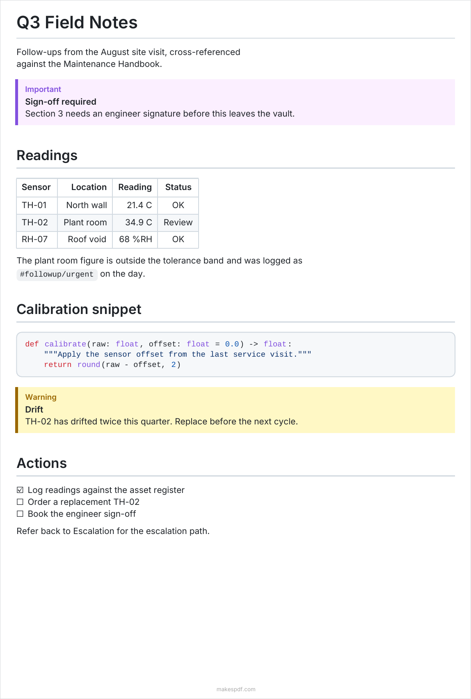

# MakesPDF

Export an Obsidian note to a typeset, accessible PDF using the
[makespdf.com](https://makespdf.com?ref=obsidian) API.

Obsidian's built-in export prints the rendered view. This plugin sends the note's
markdown to a layout service that produces a tagged PDF: real heading structure,
alt text on figures, table headers, and reading order. Output is
PDF/A-2A + PDF/UA-1 compliant, which is what accessibility and archival
requirements generally ask for.



*A note containing callouts, wikilinks, a table, a code block, and task items,
exported with the default settings.*

## Network use and privacy

**This plugin sends note content to a remote server.** It cannot work offline.

- When you run an export, the note's markdown is POSTed to
  `https://makespdf.com/api/v1/md` and the resulting PDF is written back into
  your vault. Nothing else is transmitted.
- Embedded local images are read from your vault and inlined into that same
  request. Embedded notes (`![[note]]`) are inlined too, so their contents are
  sent as well.
- No analytics or telemetry are collected by the plugin.
- The endpoint you talk to is configurable. Point **API URL** at your own
  deployment if you do not want to use the hosted service.
- Uploaded source and rendered output are retained by the service for 7 days so
  you can re-download them, then deleted. See the
  [makespdf.com privacy policy](https://makespdf.com/legal/privacy?ref=obsidian).

## Account and cost

No account is required. Without an API key the plugin uses a free anonymous
path, which is rate limited by IP (60/hour, 200/day) and capped at 20 pages per
export.

Adding an API key from a [makespdf.com](https://makespdf.com?ref=obsidian)
account raises those limits and removes the page cap. Exports made with a key
draw on that account's render credits (1 credit per 10 pages), less any free
page allowance currently in effect.

## Usage

- **Command palette:** "Export current note to PDF"
- **Ribbon icon:** the PDF export button in the left sidebar

The PDF is written next to the note, or into the folder set in **Output folder**.
Re-exporting overwrites the previous file.

### What gets converted

Obsidian-specific syntax is translated to GitHub Flavored Markdown before
export:

| Obsidian | Becomes |
|---|---|
| `[[Page]]`, `[[Page\|Alias]]` | plain text (`Page`, `Alias`) |
| `![[note]]`, `![[note#Heading]]` | the referenced content, inlined (max 3 levels deep) |
| `![[image.png\|400]]` | a sized image |
| `==highlight==` | `<mark>` (the API does not yet paint a highlight, so the text renders plain) |
| `%%comment%%` | removed |
| `#tag`, `#nested/tag` | inline code |
| `> [!tip]`, `> [!danger]` and other callouts | the closest GFM alert |
| trailing `^block-id` | removed |

Code blocks are syntax highlighted, tables keep their alignment, and footnotes,
task lists, and Mermaid diagrams render natively.

## Settings

| Setting | Default | Description |
|---|---|---|
| API key | empty | Optional. Raises rate limits and removes the 20-page cap. |
| API URL | `https://makespdf.com` | Point at your own deployment if self-hosting. |
| Page size | A4 | A3, A4, A5, Letter, or Legal |
| Font family | Inter | Inter or Noto Sans |
| Font size | 10 | Points, 6 to 24 |
| Output folder | empty | Empty saves the PDF alongside the note. |

## Development

```bash
npm install
npm run dev        # watch build with inline sourcemaps
npm run build      # production build
npm run typecheck
npm test
```

To test against a local API service, run the makesPDF app and set **API URL** to
`http://localhost:8788`.

To load the plugin into a vault, symlink the repo into the vault's plugin
folder and enable it under Settings, Community plugins:

```bash
ln -s /path/to/makespdf-obsidian-plugin \
  /path/to/your-vault/.obsidian/plugins/makespdf
```

## License

MIT. See [LICENSE](LICENSE).
